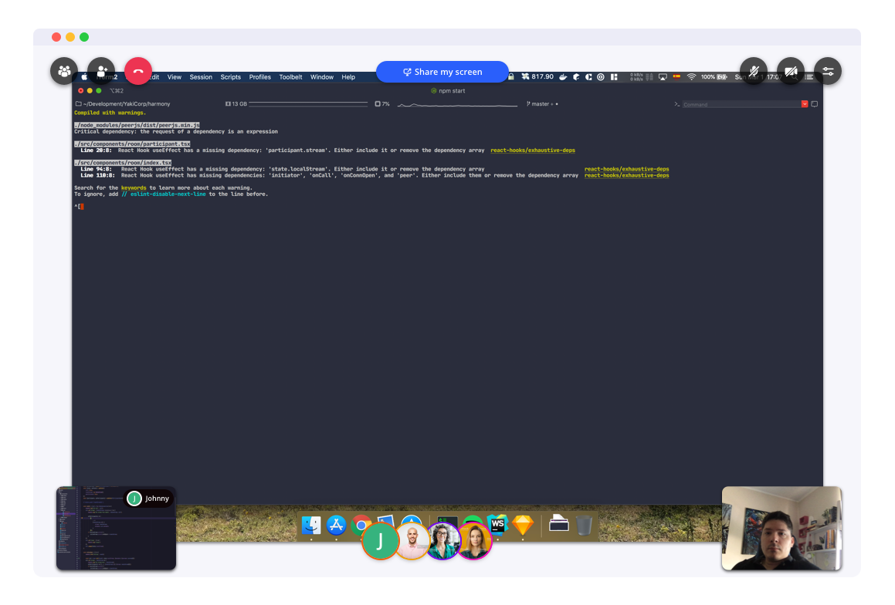

# Harmony

<h1 align="center"></h1>


WebRTC video calls made fun.

**Features**

* Video & Audio calls
* Multi-screen share

## Development

**Run the app**

```shell
$ npm start
```

**Local test**

1. Navigate to http://localhost:3000
2. Open an incognito window and navigate http://localhost:3000/room/local 
